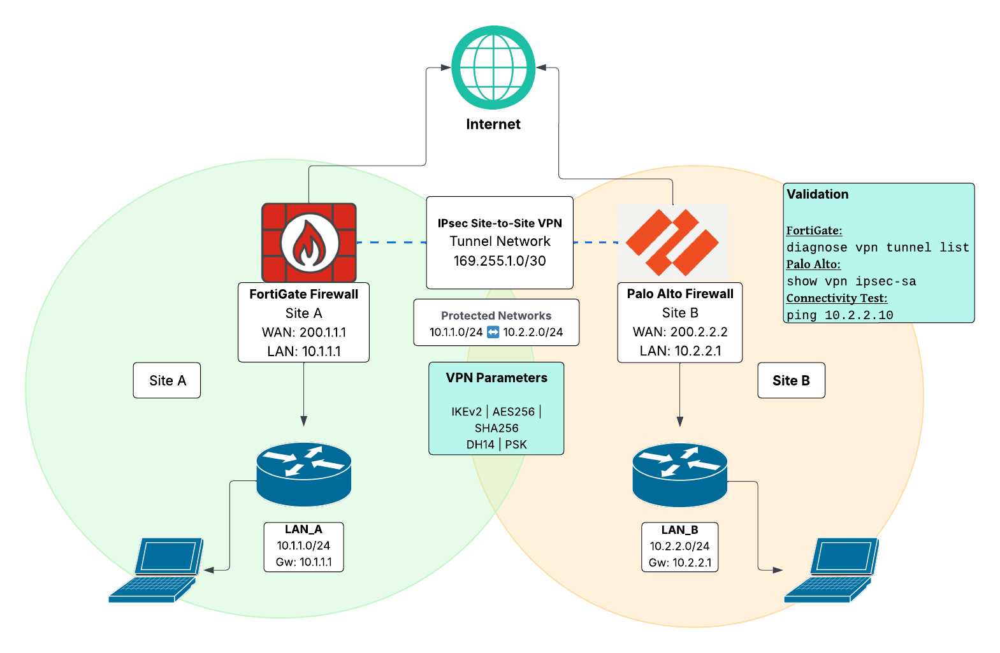

# VPN Automation Plan

# 1. Objective

The objective of this plan is to automate the deployment and validation of an IPsec Site-to-Site VPN between two heterogeneous firewall platforms:

* Fortinet FortiGate (Site A)
* Palo Alto Networks Firewall (Site B)

The automation aims to reduce manual configuration errors, ensure consistent security parameters, and provide validation mechanisms after deployment.

This approach improves operational efficiency and ensures that VPN configurations remain consistent across different security platforms.

# 2. Proposed Network Topology

The following architecture connects two remote sites through a secure IPsec VPN tunnel across the Internet.

```bash
Site A (FortiGate)                    Site B (Palo Alto)
------------------                    -------------------
LAN: 10.1.1.0/24                      LAN: 10.2.2.0/24
        |                                      |
        |                                      |
    FortiGate ----------- INTERNET ----------- Palo Alto
    WAN: 200.1.1.1                             WAN: 200.2.2.2
```

The VPN tunnel allows encrypted communication between both internal networks.

Protected networks:

* Site A: 10.1.1.0/24
* Site B: 10.2.2.0/24

## VPN Topology Diagram



# 3. Tunnel Network

The VPN will use a dedicated transit network for the tunnel interfaces.

Tunnel Network: 169.255.1.0/30

FortiGate Tunnel IP: 169.255.1.1  
Palo Alto Tunnel IP: 169.255.1.2

This tunnel network allows routing between both firewalls and is typically used in route-based VPN configurations.

# 4. VPN Type

The solution uses:
```bash
IPsec Site-to-Site VPN
IKE Version: IKEv2
```
This type of VPN provides secure encrypted communication between two remote locations over untrusted networks such as the Internet.

# 5. VPN Security Parameters

Phase 1 – IKE (Tunnel Establishment)
```bash
Encryption: AES256
Authentication: SHA256
DH Group: 14
IKE Version: IKEv2
Authentication Method: Pre-Shared Key
Lifetime: 28800 seconds
```

Phase 2 – IPsec (Data Encryption)
```bash
Encryption: AES256
Authentication: SHA256
Perfect Forward Secrecy (PFS): Group 14
Lifetime: 3600 seconds
```
Both peers must use identical parameters to successfully establish the tunnel.

# 6. Automation Strategy

The automation strategy focuses on configuring the VPN using the official APIs provided by each vendor.

Automation enables consistent deployment of configuration elements such as:

* IKE gateways
* IPsec tunnels
* security policies
* routing entries

## FortiGate Automation

Fortinet provides a REST API that allows programmatic configuration of firewall objects.

Relevant endpoints include:
```bash
/api/v2/cmdb/vpn.ipsec
/api/v2/cmdb/system.interface
/api/v2/cmdb/firewall.policy
```
Authentication is typically performed using an API token.

Automation tools that can be used include:

* Python
* Ansible
* FortiOS REST API

## Palo Alto Automation

Palo Alto firewalls expose an XML API that allows configuration and operational commands to be executed remotely.

Example operations include:

* Creating IKE gateways
* Creating IPsec tunnels
* Creating security policies

Relevant API interfaces:
```bash
XML API
REST API (available in newer PAN-OS versions)
```

Automation tools may include:

* Python
* Ansible
* Palo Alto XML API

# 7. Automation Workflow

The automation process should follow a structured sequence to deploy the VPN configuration.

1. Load VPN parameters from a configuration file (IP addresses, subnets, security parameters).
2. Validate input parameters:
   - IP address format
   - subnet definitions
   - encryption compatibility between devices.
3. Configure the FortiGate device:
   - create Phase 1 interface
   - create Phase 2 selectors
   - configure tunnel interface
   - configure firewall policy
   - configure routing for the remote network.
4. Configure the Palo Alto firewall:
   - create IKE Gateway
   - create Tunnel Interface
   - create IPSec Tunnel
   - configure security policies
   - configure routing between networks.
5. Commit configuration changes on the Palo Alto firewall.
6. Perform validation checks to confirm tunnel establishment.
7. Execute connectivity tests between protected networks.
8. Generate alerts if validation fails.

# 8. Challenges in Heterogeneous Automation

Automating VPN configuration across different vendors introduces several challenges.

## Different API Models

FortiGate uses a REST-based API, while Palo Alto traditionally relies on an XML API.

## Configuration Structure Differences

Each platform organizes VPN configuration differently.

For example:

* FortiGate typically uses route-based VPN configurations with tunnel interfaces, while Palo Alto requires tunnel interfaces associated with security zones.
* Palo Alto uses tunnel interfaces and security zones

## Parameter Compatibility

Encryption algorithms, DH groups, and authentication settings must match on both devices.

Any mismatch will prevent tunnel establishment.

## Authentication Handling

Automation systems must securely store and manage:

* API tokens
* device credentials
* authentication keys

Secure credential storage mechanisms should be used.

# 9. VPN Configuration Validation Strategy

After deployment, the automation system must verify that the VPN is correctly configured and operational.

Validation includes both configuration checks and connectivity tests.

## Configuration Validation

The automation script should verify:

* IKE gateway configuration
* IPsec tunnel status
* firewall policies allowing traffic
* routing configuration between networks

Example commands:

## FortiGate
```bash
diagnose vpn tunnel list
get vpn ipsec tunnel summary
```
## Palo Alto
```bash
show vpn ike-sa
show vpn ipsec-sa
```

## Connectivity Testing

The automation system should perform connectivity tests between the protected networks.

Example tests:
```bash
ping 10.2.2.10 from Site A
ping 10.1.1.10 from Site B
```
If connectivity fails, the script should generate an alert indicating potential VPN issues.

# 10. Alert Handling

If any validation step fails, the automation system should generate a clear alert indicating the problem.

Possible issues include:

* Tunnel not established
* Incorrect VPN parameters
* Routing misconfiguration
* Firewall policy blocking traffic

Alerts can be integrated with monitoring platforms such as:

* PRTG
* Syslog
* Email notifications

# 11. Optional Automation Scripts

Example scripts that could be included in the repository:
```bash
deploy_vpn.py
fortigate_vpn.py
paloalto_vpn.py
vpn_test.py
```
These scripts would demonstrate how VPN configuration and validation can be automated using vendor APIs.

# 12. Connectivity Test Script (Optional)

A simple Python script could be implemented to verify VPN connectivity.

Example logic:

1. Execute a ping from Site A to Site B.
2. Verify response time and packet loss.
3. Report success or failure of the connectivity test.

This script could be used as part of an automated validation pipeline after VPN deployment.
